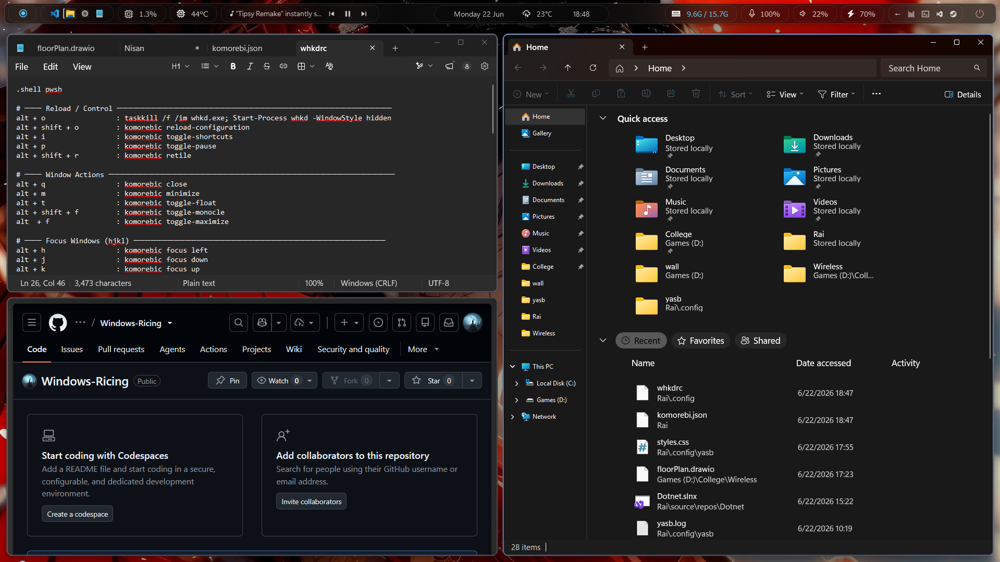

# 🍉 windows dotfiles

> komorebi · yasb · whkd · powertoys — a tiling window manager setup for Windows 11

---

## 📸 Screenshots

### Multiple Monitor


### Waybar


---

## 🧩 What's Included

| Tool | Purpose |
|---|---|
| [komorebi](https://github.com/LGUG2Z/komorebi) | Tiling window manager |
| [whkd](https://github.com/LGUG2Z/whkd) | Hotkey daemon for komorebi |
| [YASB](https://github.com/amnweb/yasb) | Status bar |
| [PowerToys](https://github.com/microsoft/PowerToys) | System utilities (Run, Keyboard Manager, etc.) |

---

## 📁 Repo Structure

```
dotfiles/
├── komorebi/
│   ├── komorebi.json          # Tiling WM config
│   └── komorebi.bar.json      # komorebi bar config (i'm using YASB waybar so i dont have komorebi bar)
├── whkd/
│   └── whkdrc                 # Hotkey bindings
├── yasb/
│   ├── config.yaml            # Bar layout and widgets
│   └── styles.css             # Bar styling
├── powertoys/
│   └── settings.json          # PowerToys settings export
├── Screenshots                # Screenshots 
└── README.md
```

---

## ⚡ Dependencies

Install all required tools via winget:

```powershell
winget install LGUG2Z.komorebi
winget install LGUG2Z.whkd
winget install amnweb.yasb
winget install Microsoft.PowerShell
winget install Microsoft.PowerToys
```

---

## 🚀 Installation

### 1 — Enable long path support (run as Admin)

```powershell
Set-ItemProperty 'HKLM:\SYSTEM\CurrentControlSet\Control\FileSystem' -Name 'LongPathsEnabled' -Value 1
```

### 2 — Clone this repo

```powershell
git clone https://github.com/shadow-eljan/Windows-Ricing.git
cd dotfiles
```

### 3 — Copy config files

```powershell
# komorebi
Copy-Item "komorebi\komorebi.json" "$env:USERPROFILE\komorebi.json"
Copy-Item "komorebi\komorebi.bar.json" "$env:USERPROFILE\komorebi.bar.json"

# whkd
New-Item -ItemType Directory -Force "$env:USERPROFILE\.config"
Copy-Item "whkd\whkdrc" "$env:USERPROFILE\.config\whkdrc"

# yasb
New-Item -ItemType Directory -Force "$env:USERPROFILE\.config\yasb"
Copy-Item "yasb\config.yaml" "$env:USERPROFILE\.config\yasb\config.yaml"
Copy-Item "yasb\styles.css" "$env:USERPROFILE\.config\yasb\styles.css"
```

### 4 — Fetch app-specific komorebi rules

```powershell
komorebic fetch-asc
```

### 5 — Start komorebi

```powershell
komorebic start --whkd
```

### 6 — Enable autostart on boot

```powershell
komorebic enable-autostart --whkd
```

---

## ⌨️ Hotkeys

### Window Focus
| Hotkey | Action |
|---|---|
| `Alt + H` | Focus left |
| `Alt + J` | Focus down |
| `Alt + K` | Focus up |
| `Alt + L` | Focus right |

### Window Movement
| Hotkey | Action |
|---|---|
| `Alt + Shift + H` | Move window left |
| `Alt + Shift + J` | Move window down |
| `Alt + Shift + K` | Move window up |
| `Alt + Shift + L` | Move window right |
| `Alt + Shift + Enter` | Promote window to main |

### Workspaces
| Hotkey | Action |
|---|---|
| `Alt + 1-7` | Switch to workspace |
| `Alt + Shift + 1-7` | Move window to workspace |

### Window State
| Hotkey | Action |
|---|---|
| `Alt + F` | Fullscreen (monocle/maximize) |
| `Alt + T` | Toggle float |
| `Alt + M` | Minimize |
| `Alt + Q` | Close |

### Layouts
| Hotkey | Action |
|---|---|
| `Alt + Space` | Cycle layouts |
| `Alt + X` | Flip horizontal |
| `Alt + Y` | Flip vertical |

### Stacking
| Hotkey | Action |
|---|---|
| `Alt + Arrow keys` | Stack window in direction |
| `Alt + ;` | Unstack |
| `Alt + [` | Cycle stack previous |
| `Alt + ]` | Cycle stack next |

### Resize
| Hotkey | Action |
|---|---|
| `Alt + =` | Increase width |
| `Alt + -` | Decrease width |
| `Alt + Shift + =` | Increase height |
| `Alt + Shift + -` | Decrease height |

### System
| Hotkey | Action |
|---|---|
| `Alt + Shift + O` | Reload komorebi config |
| `Alt + O` | Reload whkd hotkeys |
| `Alt + P` | Pause/unpause tiling |
| `Alt + Shift + R` | Retile all windows |
| `Alt + I` | Toggle hotkey overlay |

---

## 🎨 Theme

Catppuccin Mocha — change `"name"` in `komorebi.json` to `"Latte"`, `"Frappe"`, or `"Macchiato"` for other variants.

---

## 🪟 Workspaces

| Workspace | Layout |
|---|---|
| I | BSP (Binary Space Partition) |
| II | Vertical Stack |
| III | Horizontal Stack |
| IV | Ultrawide Vertical Stack |
| V | Rows |
| VI | Grid |
| VII | Right Main Vertical Stack |

---

## ⚠️ PowerToys Notes

- **FancyZones** — disable it, conflicts with komorebi tiling
- **PowerToys Run** — keep it, no conflict
- **Keyboard Manager** — fine for non-tiling remaps
- **Snap Layouts** — disable or ignore

---

## 🔧 Useful Commands

```powershell
komorebic stop --whkd          # Stop everything
komorebic reload-configuration # Reload config without restart
komorebic restore-windows      # Unstick hidden windows
komorebic check                # Validate config
komorebic state                # View current WM state
```

---

## 📝 License

Do whatever you want with these configs. No license, no restrictions.